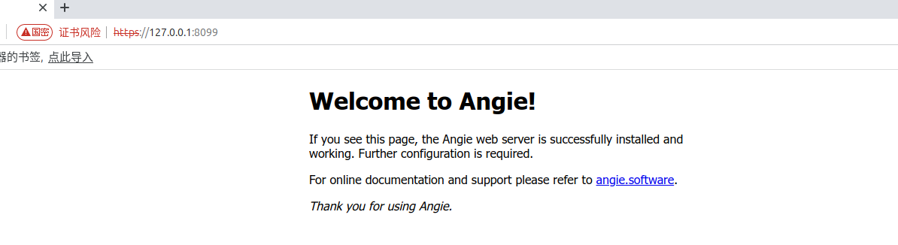

# angie-docker

## 三种镜像变体

| Dockerfile | SSL 库 | 国密 NTLS | HTTP/3 | 说明 |
|---|---|---|---|---|
| `Dockerfile` | 铜锁 8.4.0 (OpenSSL 3.0.3) | 支持 | 有，但**无 0-RTT** | 国密主力镜像 |
| `Dockerfile-template` | 铜锁 8.4.0 (OpenSSL 3.0.3) | 支持 | 有，但**无 0-RTT** | 同上 + gomplate 模板渲染 |
| `Dockerfile-h3` | OpenSSL 3.5.7 | **不支持** | 完整（含 0-RTT） | 高性能 HTTP/3 镜像 |


## 快速开始

1. 构建镜像

* 构建主镜像（极简版：`CMD ["angie","-g","daemon off;"]`，PID1 即 angie master，前台运行）

```shell
docker buildx build -t angie:ntls-alpine -f Dockerfile .
```

* 构建支持 template 的镜像（`/init` 启动 + `ANGIE_*` ENV 渲染 `angie.conf.template`）

```shell
docker buildx build -t angie:ntls-template-alpine -f Dockerfile-template .
```

* 构建 HTTP/3 镜像

```shell
docker buildx build -t angie:h3-alpine -f Dockerfile-h3 .
```

2. 运行容器

```shell
docker run --rm --name angie-ntls --ulimit nofile=65536:65536 \
  -p 8089:80 -v http.d:/etc/angie/http.d -v stream.d:/etc/angie/stream.d \
  angie:ntls-alpine
```

* 运行 HTTP/3 镜像（HTTP/3 走 UDP，**必须**放通 443/udp）

```shell
docker run --rm --name angie-h3 \
  -p 80:80 -p 443:443 -p 443:443/udp \
  angie:h3-alpine
```

3. 验证NTLS支持

```text
angie -V
Angie version: Angie/1.12.1
nginx version: nginx/1.31.2
built on Fri, 28 Aug 2026 05:26:45 GMT
built by gcc 14.2.0 (Alpine 14.2.0)
built with OpenSSL 3.0.3 3 May 2022
TLS SNI support enabled
configure arguments: --prefix=/etc/angie --conf-path=/etc/angie/angie.conf --error-log-path=/var/log/angie/error.log 
--http-log-path=/var/log/angie/access.log --lock-path=/run/angie.lock --modules-path=/usr/lib/angie/modules 
--pid-path=/run/angie.pid --sbin-path=/usr/sbin/angie --http-acme-client-path=/var/lib/angie/acme 
--http-client-body-temp-path=/var/cache/angie/client_temp --http-fastcgi-temp-path=/var/cache/angie/fastcgi_temp 
--http-proxy-temp-path=/var/cache/angie/proxy_temp --http-scgi-temp-path=/var/cache/angie/scgi_temp 
--http-uwsgi-temp-path=/var/cache/angie/uwsgi_temp --user=angie --group=angie --with-file-aio --with-http_acme_module 
--with-http_addition_module --with-http_auth_request_module --with-http_dav_module --with-http_flv_module 
--with-http_gunzip_module --with-http_gzip_static_module --with-http_mp4_module --with-http_random_index_module 
--with-http_realip_module --with-http_secure_link_module --with-http_slice_module --with-http_ssl_module 
--with-http_stub_status_module --with-http_sub_module --with-http_v2_module --with-http_v3_module --with-mail 
--with-mail_ssl_module --with-stream --with-stream_acme_module --with-stream_mqtt_preread_module 
--with-stream_rdp_preread_module --with-stream_realip_module --with-stream_ssl_module --with-stream_ssl_preread_module 
--with-threads --with-ld-opt='-Wl,--as-needed,-O1,--sort-common -Wl,-z,pack-relative-relocs' 
--with-openssl=../tongsuo-8.4.0 --with-openssl-opt=enable-ntls --with-ntls --add-dynamic-module=../ngx_brotli 
--add-dynamic-module=../headers-more-nginx-module --add-dynamic-module=../echo-nginx-module 
--add-dynamic-module=../ngx_http_substitutions_filter_module --add-dynamic-module=../ngx_cache_purge 
--add-dynamic-module=../nginx-dav-ext-module --add-dynamic-module=../ngx_devel_kit 
--add-dynamic-module=../set-misc-nginx-module
```

## NTLS（国密）站点

### 规则

1. **一个端口只能挂一个国密站点**：NTLS 握手只发生在 default vhost 的 SSL_CTX/证书上（SNI 路由在握手之后才生效），所以 default vhost 本身必须就是 `sign:/enc:` 双证书的 NTLS vhost；
2. **双证书必须用 `sign:`/`enc:` 前缀**（不是空格分隔——两条 `ssl_certificate` 只有第一条生效，且无后缀双证书 vhost 实测只服务国密）；
3. **`ssl_ntls on` 是双模式**：不关闭标准 TLS，同一 vhost 仍服务 TLS1.2/1.3（含 `TLS_SM4_GCM_SM3` 国套件）；
4. **`ssl_protocols` 不影响 NTLS 协商**（NTLSv1.1 总能协商成功）。

参考模板已内置在镜像 `/etc/angie/http.d/ntls-gm.conf.example`（仓库 `http.d/ntls-gm.conf.example`），启用国密 443 时改为 `.conf` 并填证书路径：

```nginx
server {
    # ★ NTLS 握手只用 default vhost 的证书：一端口一国密站点
    listen 443 ssl default_server;
    server_name gm.example.com;

    ssl_ntls on;
    # 签名/加密双证书（sign:/enc: 前缀，顺序：签名在前）
    ssl_certificate sign:/etc/angie/certs/sm2/server_sign.crt
                  enc:/etc/angie/certs/sm2/server_enc.crt;
    ssl_certificate_key sign:/etc/angie/certs/sm2/server_sign.key
                  enc:/etc/angie/certs/sm2/server_enc.key;
    # 实测可用的 TLCP（NTLSv1.1）套件
    ssl_ciphers "ECDHE-SM2-SM4-GCM-SM3:ECC-SM2-SM4-GCM-SM3:ECDHE-SM2-SM4-CBC-SM3:ECC-SM2-SM4-CBC-SM3";
    ssl_protocols TLSv1.2 TLSv1.3;
    ssl_prefer_server_ciphers on;

    location / { root /usr/share/angie/html; }
}
```




## HTTP/3 配置参考

`Dockerfile-h3` 构建出的镜像支持完整 HTTP/3（含 0-RTT）。监听配置：

```nginx
server {
    listen 443 quic reuseport;   # QUIC / UDP，reuseport 配合多 worker
    listen 443 ssl;              # 同时保留 TCP 回退

    ssl_certificate     /etc/angie/certs/rsa/hserver.crt;
    ssl_certificate_key /etc/angie/certs/rsa/hserver.key;

    ssl_protocols TLSv1.3;       # QUIC 强制要求 TLS 1.3
    ssl_early_data on;           # 0-RTT，仅 OpenSSL >= 3.5.1 生效

    http3 on;
    quic_retry on;
    quic_gso on;                 # 网卡支持 GSO 时开启

    location / {
        add_header Alt-Svc 'h3=":443"; ma=86400';   # 告知客户端支持 h3
        root /usr/share/angie/html;
    }
}
```

验证：

```shell
curl -v --http3 https://your-server.example   # 看到 "using HTTP/3" 即成功
```


## ssl-gm.conf 参考

```shell
# /etc/angie/http.d/ssl-gm.conf

server {
    # 监听 8099 端口并开启 SSL                                                                                               
    listen 8099 ssl;                                                                                                         
    server_name localhost;
    # 1. 启用 NTLS (国密协议)                                                                                                
    ssl_ntls on;

    # 2. 配置国密算法证书 (签名证书与加密证书分离) 请确保将实际的证书文件放在对应路径下
    ssl_certificate     /etc/angie/certs/gm/server_sign.crt /etc/angie/certs/gm/server_enc.crt; 
    ssl_certificate_key /etc/angie/certs/gm/server_sign.key /etc/angie/certs/gm/server_enc.key;

    # 3. 配置标准 RSA 算法证书
    # 用于不支持国密算法的国际主流浏览器 (如 Chrome, Edge, Firefox)
    ssl_certificate     /etc/angie/certs/rsa/hserver.crt;
    ssl_certificate_key /etc/angie/certs/rsa/hserver.key;

    # 4. 配置加密套件与协议
    # 确保包含国密套件，同时兼容标准 TLS 套件
    ssl_ciphers ECC-SM2-SM4-CBC-SM3:ECDHE-SM2-WITH-SM4-SM3:ECDHE-RSA-AES128-GCM-SHA256:ECDHE-RSA-AES256-GCM-SHA384:ECDHE-RSA-AES128-SHA256:AES128-GCM-SHA256:AES256-GCM-SHA384:!aNULL:!eNULL:!RC4:!DES:!3DES:!MD5:!DSS:!PKS;
    ssl_protocols TLSv1 TLSv1.1 TLSv1.2 TLSv1.3;
    ssl_prefer_server_ciphers on;

    # 5. 默认首页配置 (使用 Angie 默认的 index.html)
    location / {
        root /usr/share/angie/html;
        index index.html index.htm;
    }
}
```

## 安全说明

- `/status/`（stub_status）与 `/console/`、`/console/api/` 在 `http.d/default.conf` 中均限制为 `allow 127.0.0.1; deny all;`，需要外部访问时请改为实际内网段并配合反向代理认证；
- 建议 HTTPS 站点加 HSTS：`add_header Strict-Transport-Security "max-age=31536000" always;`
